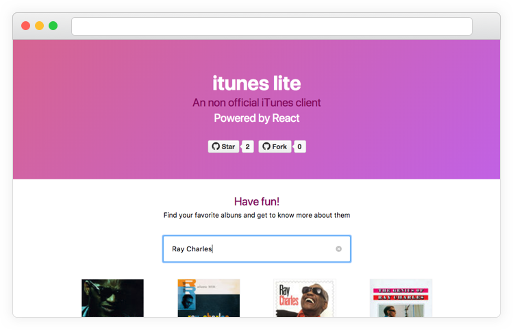

# iTunes lite
> iTunes player built with React

[Demo](https://itunes-lite-fodbcqxifo.now.sh/)

- [About this project](#about-this-project)
- [How can I contribute?](#how-can-i-contribute)
- [History](#history)
- [Contributors](#contributors)

## About this project
The intention of this project is to be used as a playground to practice React and the tools of its ecosystem. The idea is to use the [iTunes Search API](itunesapi)

## How can I contribute?
Do you want to help? That's awesome. There are some things you can do to help:
- suggest new features
- file bugs
- suggest different implementations
- write tests

## History
1. Created using `create-react-app`
1. Implemented first version without any state management library
1. Implemented second version with redux and redux-thunk

## Contributors

|  |  |
| ------------------------- | ------------------------- |
| Ciro Nunes                | Fernando Souza            |

[itunesapi]: https://affiliate.itunes.apple.com/resources/documentation/itunes-store-web-service-search-api/
